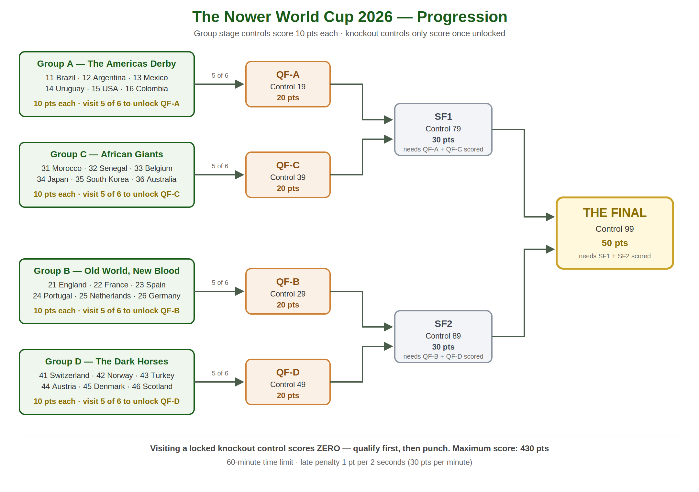

# The Nower World Cup 2026 — Final Details (score course section)

**Mole Valley Orienteering Club — Summer Series**
Monday 22 June 2026 | Starts 18:30–19:30

> Draft text for the final details, to be published once the course has been
> fully checked. The event-page summary on the website deliberately omits
> control counts, points values and qualification thresholds so these can be
> tweaked without re-publishing — if the scoring rules change, update this
> file, `competitor_rules.md`, `worldcup_results.py`, `index.html` and
> `README.md` together.

---

**For the experienced or adventurous: 1-hour score, World Cup special format.**

"Score" means there is no set course. Your map will show 31 controls; you choose which and how many to visit. You get points for each control you visit and lose points if you take more than an hour.

The controls are organised like the World Cup: a group stage, then knockout rounds.

**Group stage:** there are four groups of six controls — Group A (controls 11–16), Group B (21–26), Group C (31–36) and Group D (41–46). Each group control is worth **10 points**, and you can visit them in any order.

**Knockout rounds:** the quarter-finals (19, 29, 39, 49) are worth **20 points**, the semi-finals (79, 89) **30 points**, and the Final (99) **50 points** — but knockout controls only score if you have *qualified* for them:

- A quarter-final scores only if you have visited **at least 5 of the 6 controls** in its group (e.g. control 19 needs 5 from Group A).
- A semi-final scores only if **both** of its quarter-finals scored (79 needs 19 and 39; 89 needs 29 and 49).
- The Final scores only if **both** semi-finals scored.

Visiting a knockout control you haven't qualified for scores **zero** — the app will beep, but the points won't count. Qualification is checked automatically in the results processing after the event, so the score shown in the app on the day may differ from the official results. The order matters: qualify *before* you visit the knockout control (though you may return to it later if you qualify afterwards).

Maximum possible score: **430 points**.

**Penalty if over 60 minutes:** 1 point per 2 seconds (30 points per minute).

*(Diagram source: `bracket_diagram.svg` — regenerate the PNG with
`python3 -c "import cairosvg; cairosvg.svg2png(url='bracket_diagram.svg', write_to='bracket_diagram.png', scale=2)"`
after any rule change.)*
